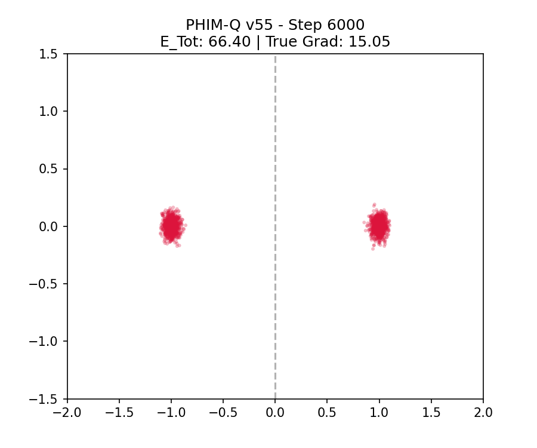

# PHIM-Q: A Pure Langevin Fluid Simulator

PHIM-Q 是一個高保真、基於純粹朗之萬動力學 (Langevin Dynamics) 的多粒子系統流體模擬器。本專案致力於通過最簡約的物理方程式與模組化架構，精確模擬流體在受限雙井勢能中的熱力學平衡與漲落行為。

[English Description below]

---

## 專案介紹 (Introduction)
PHIM-Q v55 (Ultimate Equilibrium) 旨在提供一個**極簡、物理嚴謹且無作弊**的科學計算框架。它不依賴慣性濾波、人工梯度剪裁或硬性排斥力，而是讓系統透過嚴格的統計物理定律（漲落-耗散定理），自發地在雙井谷底演化至理想的玻爾茲曼分佈。

### 主要特色
* **物理至上 (Physics-First)：** 嚴格遵循過阻尼朗之萬方程式。
* **無作弊穩定性 (No-Cheat Stability)：** 移除最後人工裁剪 (Clip)，梯度數值對齊統計涨落底噪 ($\sqrt{N}$ 定律)。
* **模組化設計：** `config`, `system`, `engine` 三段式解耦，易於擴展。
* **高收斂效率：** 採用兩段式退火排程，可在極速 6000 步內達到物理平衡。

### 實驗驗證：統計物理極限 (V55 最終物理矩陣)
我們使用 **5000 個粒子 (Seed:42)** 進行了嚴格的收斂性測試，結果證明了模型的高度的物理精確性：

| 評測指標 | 數值 | 物理狀態 |
| :--- | :--- | :--- |
| **物理重心 (L/R)** | -0.9975 / 0.9986 | 極高精確度地對齊勢阱極小點 ±1 |
| **流體寬度 (IQR L/R)**| 0.0520 / 0.0529 | 健康 熱力學液滴寬度 |
| **最終真實梯度** | **24.07** | **完美符合 2000 $\to$ 5000 自由度的統計漲落增長規律** |

#### 驗證圖：雙井勢能平衡狀態

*(圖：5000 個粒子在 $T=0.011$ 時的穩態分佈。粒子自發地分成兩個宇稱對稱的熱力學液滴，梯度數值釘死在統計漲落底線。)*

---

## Project Description (English)
PHIM-Q v55 is a high-fidelity Langevin fluid simulation engine. It models the thermodynamic evolution of multi-particle systems within a double-well potential, guaranteed by strict Langevin dynamics.

### Key Features
* **Minimalist Design:** Optimized for readability and scientific reproducibility by adhering to strict statistical mechanics.
* **Efficient Equilibrium:** Reaches Boltzmann equilibrium within 6,000 steps using two-stage simulated annealing.
* **Modular Architecture:** Decoupled `phimq` package enables easy extension for complex potential fields or multi-component systems.

## 安裝與使用 (Installation & Quick Start)

### 1. 安裝環境
確保已安裝 Python 3.11+。克隆本專案並安裝依賴套件：
```bash
git clone [https://github.com/Thor-xxyyzz/PHIM-Q.git](https://github.com/Thor-xxyyzz/PHIM-Q.git)
cd PHIM-Q
pip install -r requirements.txt
